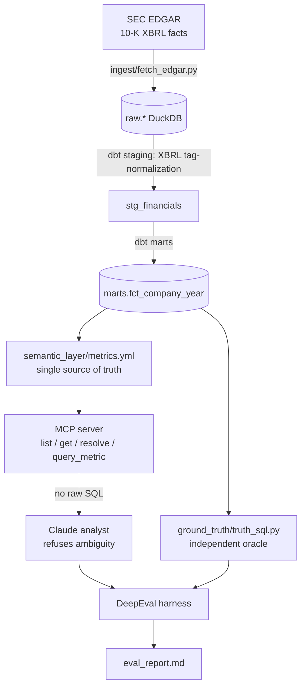

# Governing the AI Analyst

[](https://github.com/mrasmussen595/semantic-layer-eval/actions/workflows/ci.yml)
[](pyproject.toml)
[](LICENSE)
[](transform/)
[](eval/)

> **Thesis.** LLM analytics agents are dangerous because they invent or inconsistently
> compute metrics. The fix is a **semantic layer the agent is forced through**, plus an
> **eval harness that catches wrong numbers before they reach a user.**

This repo operationalizes that thesis end-to-end on **real, audited data** — the SEC 10-K
filings of 10 public SaaS companies — and proves it with a runnable eval.

**What it proves, in one screen** (`eval/report/eval_report.md`, regenerated every CI run):

| | result |
|---|---|
| Golden questions — reported number matches independent ground truth | **9 / 9** |
| Adversarial questions — agent refuses instead of guessing | **9 / 9** |
| Planted wrong number — harness catches it | **caught** |

---

## Why this is a real test, not a toy

1. **The data is audited and externally verifiable.** Ground truth is computed from SEC
   XBRL facts and anchored to the actual filings (e.g. Snowflake FY2024 revenue =
   `$2,806,489,000`). A reviewer can check it. Nobody can dismiss the eval as "made-up
   data graded against a made-up answer."
2. **The metric ambiguity is genuine.** SaaS financial metrics are contested *in the wild*:
   - `gross_margin` — GAAP vs non-GAAP (does cost of revenue include stock-based comp?)
   - `rule_of_40` — everyone agrees "growth % + profitability %", but the second term is
     genuinely disputed (FCF margin? operating margin? EBITDA margin?). The governed layer
     pins it to **FCF margin** — one definition, applied identically to all 10 companies.
   - bare **"margin"** maps to three different governed metrics → the agent must ask which.
3. **The governance is enforced in code, not just prompted.** There is no raw-SQL path
   anywhere. The agent can only call governed tools, and SQL is compiled solely from the
   semantic layer (proven by the guard tests in `tests/test_no_raw_sql.py`).

## Architecture



## The governed metrics

Seven metrics, defined once in `semantic_layer/metrics.yml`:

| metric | definition | governance angle |
|---|---|---|
| `total_revenue` | GAAP total revenue | "which revenue line" |
| `revenue_growth_yoy` | (rev − prior rev) / prior rev | — |
| `gross_margin` | gross profit / revenue (GAAP) | GAAP vs non-GAAP; **admits gaps** (Workday) |
| `operating_margin` | operating income / revenue (GAAP) | GAAP vs non-GAAP |
| `rnd_intensity` | R&D / revenue | — |
| `fcf_margin` | (operating cash flow − capex) / revenue | FCF definition disputed |
| `rule_of_40` | `revenue_growth_yoy` + `fcf_margin` (points) | **contested second term, pinned** |

Companies: Salesforce, Snowflake, Datadog, CrowdStrike, ServiceNow, Workday, HubSpot,
Atlassian, MongoDB, Cloudflare — deliberately mixed fiscal calendars (Jan / Jun / Dec).

## How the agent behaves

```
Q: "How's our margin looking?"
A: REFUSED — 'margin' is ambiguous between gross_margin, operating_margin, fcf_margin.
   Which one, and over what fiscal year?

Q: "What was Workday's gross margin in fiscal 2024?"
A: REFUSED — not available for WDAY FY2024 in the governed source (Workday does not tag a
   consolidated gross profit). I won't estimate it.

Q: "What was Snowflake's non-GAAP gross margin in fiscal 2024?"
A: REFUSED — the governed metric is GAAP; a non-GAAP variant is not governed here.

Q: "What was Snowflake's total revenue in fiscal 2024?"
A: total_revenue for SNOW FY2024 = 2,806,489,000   (from query_metric, anchored to the 10-K)
```

See it live: `uv run python scripts/demo.py` (no API key required).

## Quickstart

```bash
cp .env.example .env        # optional: set ANTHROPIC_API_KEY for the live agent
./init.sh                   # uv sync -> load snapshot -> dbt build -> run the eval
```

`init.sh` uses a committed public-domain data snapshot by default (offline, reproducible).
To pull fresh facts from live SEC EDGAR, set `SEC_USER_AGENT` and run with `REFRESH_EDGAR=1`.

Run the governance eval directly:

```bash
uv run python -m eval.harness                 # deterministic reference agent (offline)
AGENT_USE_LLM=1 uv run python -m eval.harness # live Claude agent (needs ANTHROPIC_API_KEY)
```

## How it works

- **Ingest** (`ingest/fetch_edgar.py`) pulls the SEC `companyfacts` XBRL API, keeps only
  the us-gaap concepts the metrics need on form 10-K, and lands long-format `raw.facts`.
- **Transform** (`transform/`, dbt) normalizes inconsistent XBRL tags (e.g. CrowdStrike
  tags revenue `...IncludingAssessedTax`, peers `...Excluding`) into one canonical
  `marts.fct_company_year`. dbt tests fail the build if normalized revenue ever drifts
  from the filing anchors.
- **Semantic layer** (`semantic_layer/`) is the single source of truth. The loader
  validates every `sql_expression` against a column allowlist and resolves free text to
  metric(s) with longest-phrase precedence.
- **MCP server** (`mcp_server/`) exposes exactly four governed tools. The compiler builds
  SQL only from the definition; filter values are always bound parameters.
- **Agent** (`agent/`) — a live Claude agent and a deterministic reference agent, both
  emitting the same gradeable response, both bound to the governance contract.
- **Eval** (`eval/`) — DeepEval metrics grade correctness vs an **independent** ground
  truth (`ground_truth/truth_sql.py`, hand-written, not the compiler) and refusal behavior.

## Two honest notes

- The eval's headline correctness/refusal numbers are produced by the **deterministic
  reference agent**, so they run offline in CI with no API cost or nondeterminism. That
  agent isolates the *governance mechanism*; the **live Claude agent** (`AGENT_USE_LLM=1`)
  is what stress-tests an actual LLM under the same contract.
- `gross_margin` is intentionally **null for Workday** — the company doesn't tag a
  consolidated gross profit. The governed layer surfaces "not available" rather than
  fabricating, which is itself part of the thesis.

## MotherDuck

Development runs on local DuckDB. `db.py` is the single swap-in seam: set `MOTHERDUCK_TOKEN`
(and optionally `MOTHERDUCK_DATABASE`) and the same code reads from MotherDuck instead. No
other change is required.

## Data source & license

Data is SEC EDGAR (U.S. public domain). A 13 KB raw snapshot is committed under `fixtures/`
for reproducible offline builds; the full 25 MB companyfacts JSON is re-fetchable and
gitignored. Code is MIT (`LICENSE`).
